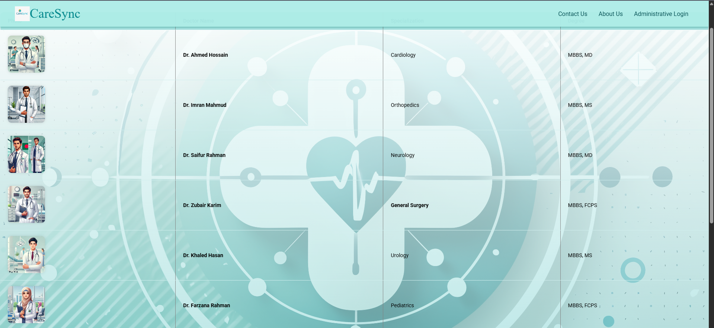

# CareSync - Hospital Management System

**CareSync** is a hospital management system developed entirely by **Abdullah Al Fahad**. It provides secure and organized access for patients, staff, and administrators to manage healthcare operations, appointments, and emergency requests like blood donations.

---

## 🚀 Features

### 👨‍⚕️ Patient Portal
- Login securely as a patient
- View doctor profiles with photos, specialization, and degrees
- Book appointments with doctors
- Download medical reports in PDF format
- Submit blood requests when in need

### 🧑‍💼 Staff Dashboard
- Login access for hospital staff
- View registered patient information
- Manage and track inventory
- View and respond to blood donation requests

### 🛠️ Admin Control Panel
- Admin login access
- Add or remove staff members
- Oversee patient and staff activity
- Manage blood donor and recipient records

### 🩸 Blood Donation System
- Blood donors can register availability and group
- Recipients can request blood by group and urgency
- Enables quick matching and response between donor and recipient

---

## 🧰 Tech Stack

| Layer      | Technology     |
|------------|----------------|
| Frontend   | HTML, CSS    |
| Backend    | PHP            |
| Database   | MySQL          |
| PDF Export | FPDF Library   |

---

## 📸 Screenshots

Below are the key pages and functionalities of **CareSync**:

### 🧑‍⚕️ About Us Page

### 🩸 Blood Bank Overview

### 📝 Blood Donation Form

### 👥 Blood Donor List

### 📞 Contact Us

### 🧑‍⚕️ Doctor Profile Page

### 🔐 Patient Login

### 📄 Report Download Interface

### 👩‍💼 Staff Login Page

---
## Clone the repository
git clone https://github.com/fah-ayon/CareSync.git

## ⚙️ Setup Instructions

1. Install **XAMPP** or any local PHP server
2. Clone this repo or copy the `CareSync` folder to `C:/xampp/htdocs/`
3. Start **Apache** and **MySQL** from XAMPP
4. Open `http://localhost/phpmyadmin`
5. Create a database named `caresyncdb`
6. Import the provided `caresyncdb.sql` file to initialize the database
7. Access the project at: `http://localhost/CareSync/index.html`

## 🔒 Notes

- Default MySQL user: `root`
- Default MySQL password: *(empty)*

> Ensure FPDF is extracted in `dashboard_menu/fpdf186/` and `require('fpdf186/fpdf.php');` is correctly used in PHP files.

## 📝 License

This project is licensed under the terms described in [LICENSE.txt](LICENSE.txt).

### [**Let's connect on LinkedIn**](https://www.linkedin.com/in/abdullahalfahadayon/)
